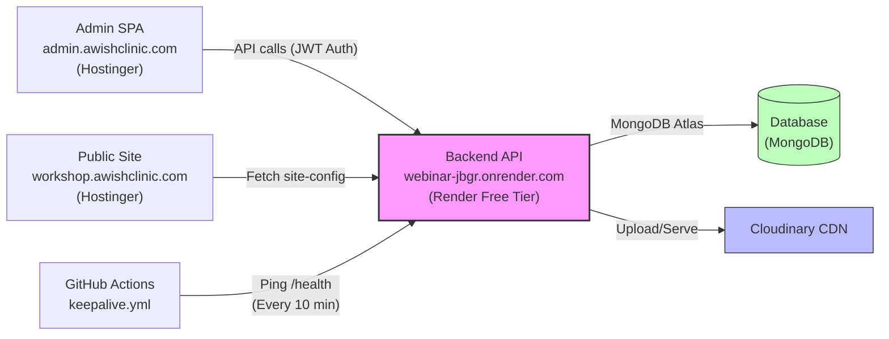

# 🌿 Youngness Institute CMS & Event-Management Platform

[](https://github.com/Abhiboss07/Webinar/actions/workflows/ci.yml)
[](https://nodejs.org/)
[](https://www.mongodb.com/)
[](https://cloudinary.com/)
[](https://razorpay.com/)

A production-ready, fully database-driven CMS and event management platform custom-tailored for managing healthcare webinars, workshops, user registrations, communications, and operations entirely from the browser.

---

## 🏗️ System Architecture

The application is structured as a decoupled, multi-tier system. The public site and admin panels are served statically, communicating with a central Node.js/Express API that acts as the coordinator for storage, database transactions, payment validation, and cron-like keepalives.



---

## 🗂️ Component Map

| Component | Technology | Target Host | Purpose |
| :--- | :--- | :--- | :--- |
| **`backend/`** | Node.js, Express, Mongoose | Render (Web Service) | Core REST API, business logic, email queue, auto-backups |
| **`admin/`** | React, Vite, TailwindCSS | Hostinger (Subdomain) | Rich administration panel (Workshops, Media, Audit Logs, Settings) |
| **`frontend/`** | HTML5, Vanilla JS, TailwindCSS | Hostinger (Main Domain) | Static workshop registration site, SEO landing pages, QR check-in |
| **`docs/`** | Markdown Documents | — | Systems Architecture (`CMS.md`), Operations Runbook (`DEPLOYMENT.md`) |
| `google-apps-script.gs` | JavaScript / Apps Script | Google Workspace | Direct data synchronization pipeline to Google Sheets |

---

## 🚀 Key Features

*   **Database-Driven Configuration**: Website copy, branding, FAQ elements, trainer bio, active workshops, pricing, and third-party integrations (Razorpay, Cloudinary, SMTP, Google Sheets) are loaded dynamically. The client never touches code.
*   **Offline Fallback Resilience**: `frontend/config/workshop-config.js` serves as a bootstrap configuration and offline cache so the landing page still loads even if the API server is cold-starting or temporarily offline.
*   **Robust Network Fault Tolerance**: The admin panel implements automatic exponential-backoff retries for API requests to cleanly handle Render Free Tier cold-start latencies without exposing connection errors to administrators.
*   **Security by Design**: 
    *   Bcrypt password hashing & JWT refresh-token sessions.
    *   Strict Role-Based Access Control (RBAC) on all admin APIs.
    *   Client-side and server-side file security validation (MIME, checksum deduplication, and size constraints).
    *   AES-256-GCM encryption for integration secret keys in MongoDB (masked in responses).
    *   Secure backend-verified webhook signatures for all Razorpay transactions.
    *   Global and per-route rate limiters, Helmet headers, and full audit logs for state-modifying actions.

---

## 🌐 Production URLs

*   **Public Landing Page**: [workshop.awishclinic.com](https://workshop.awishclinic.com)
*   **CMS Admin Portal**: [admin.awishclinic.com](https://admin.awishclinic.com)
*   **Production API**: [webinar-jbgr.onrender.com](https://webinar-jbgr.onrender.com)
    *   *Health Endpoint*: `/health`
    *   *Sitemap*: `/sitemap.xml`
    *   *Robots*: `/robots.txt`

---

## ⚙️ Quick Start (Local & Docker Development)

The entire ecosystem can be run locally using Docker Compose, which configures the backend, frontend, admin panel, and an isolated MongoDB instance.

### 1. Configure Environments
Copy the sample environment file in the backend folder and fill in the required database, secret, and seed settings:
```bash
cp backend/.env.example backend/.env
```

### 2. Launch Services
Run Docker Compose to build and spin up the containers:
```bash
docker compose up --build
```
*   **Backend API**: `http://localhost:4000`
*   **Admin Panel**: `http://localhost:8080`
*   **MongoDB**: `mongodb://localhost:27017/youngness`

### 3. Initialize & Seed Database
In a new terminal window, run the database migrations and seed administrative credentials, templates, and sample workshop data:
```bash
docker compose exec backend npm run seed:admin
docker compose exec backend sh -c "npm run migrate:config && npm run seed:workshop && npm run seed:templates"
```

---

## 📚 Documentation Reference

For deeper insights into the project, consult the documents inside the `/docs` folder:
*   📖 **[System Blueprint & Architecture (docs/CMS.md)](docs/CMS.md)**: Details the design, databases schema model, API specs, and functional modules.
*   🛠️ **[Deployment & Operations (docs/DEPLOYMENT.md)](docs/DEPLOYMENT.md)**: Guides you through manual/automated deployments, env matrices, backups, and staging validation.

